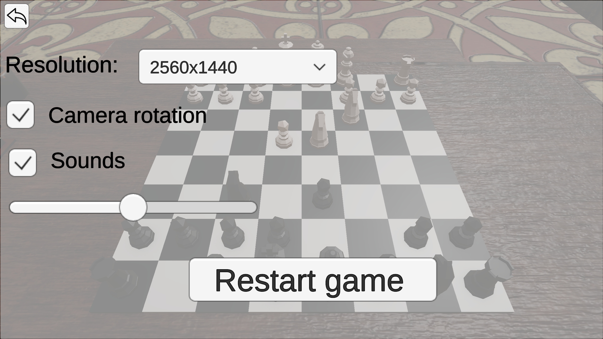
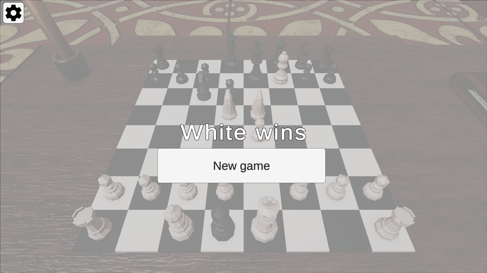

3D-Chess

Simple 3D Chess game built with Unity Engine. Includes realistic piece movements, turn-based logic, and a minimalistic interface.
This project is a fully functional, basic implementation of standard chess in 3D using the Unity game engine. It was developed as a personal project and learning experience, with all core rules implemented from scratch without relying on external implementations.
The game is currently designed for **local two-player gameplay only**, with no AI opponent or online multiplayer functionality. It is a minimal implementation focused on correctness and rule coverage rather than advanced features.

---

Rule Support
The game includes support for all standard chess rules, including:

- **Pawn promotion** (to queen, rook, bishop, or knight)
- **En passant** captures
- **Castling** (both kingside and queenside, with all conditions enforced)
- **Check, checkmate**, and **stalemate**
- **Draw detection** in recognized endgame conditions (e.g., King vs. King, King + Bishop vs. King, King + Knight vs. King)

---

Implementation Notes

All game logic, including move validation, rule enforcement, and game state management, was implemented manually. The goal was to develop a working rule-based chess system from the ground. While the logic is functionally correct, it is written in a basic and straightforward manner and may not reflect best practices in performance or software design.
This project is intended as a foundation for future expansion (e.g., AI, UI improvements, online multiplayer).

---

Visual Overview

  
  
  
  

